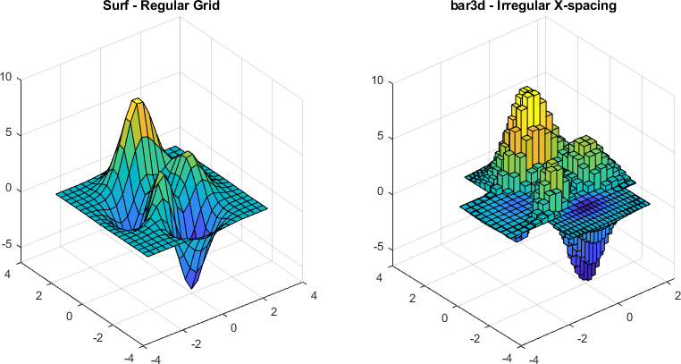

bar3d
==========
A simple 3D bar plot that allows for irregular spacing along either the x- or y-dimension.
It was used to create several of the quantization figures in [this thesis](https://open.uct.ac.za/handle/11427/28378).

